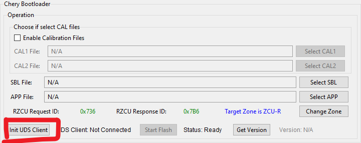

# Chery ZCU Diagnostic ToolBox

## Introduction
Chery ZCU Diagnostic ToolBox is a specialized software toolkit developed by Aptiv for Chery Automobile, specifically designed for automotive ECU diagnostics and flashing verification. This tool supports UDS diagnostic communication via CAN bus, enabling ECU flashing and parameter configuration functionalities. As a dedicated solution for Chery's ZCU (Zone Control Unit) development and validation, it ensures reliable and efficient ECU programming and testing processes.
**Key Features:**

   - Support for standard CAN and CAN-FD communication
   - UDS diagnostic protocol support
   - Independent or combined flashing of APP and CAL partitions
   - Signature verification functionality
   - Complete flashing process control
   - Comprehensive flashing process logging

## Operation Instructions

### Environment Requirements
- Windows 10 or later
- Supported CAN adapter hardware
   - Vector CAN Hardware
   - PeakCAN Hardware
   - USB2CAN Hardware(under developing)
### Basic Operation Process (based on Vector Hardware)

`Step 1`: Vector Channel Configuration

Configure the specific Vector CAN channel by assigning `CANalyzer CANX` in the `Vector Hardware Config` application. Ensure the CANalyzer channel number matches the physical channel number, as shown in the figure below:

 

The channel assignment result should appear as follows:

 

`Step 2`: Initialize Vector CAN Channel Connection

After proper channel assignment, launch the application to proceed with operations:

 

Note: Successful initialization can only be achieved with the correct channel number selection:

 

`Step 3`: Establish UDS Client Connection

Once the connection is established, select the appropriate firmware based on your requirements and initiate the flashing process:

 

### Precautions

1. Ensure stable power supply during flashing
2. Recommend backing up existing data before flashing
3. Strictly follow the operation process, avoid interruption
4. Check logs for fault diagnosis in case of exceptions
## License

```shell
APTIV PROPRIETARY SOFTWARE LICENSE

Copyright (c) 2025 APTIV. All rights reserved.
Contact: jun.cao@aptiv.com

This software and all associated documentation ("Software") are the exclusive property 
of APTIV. All intellectual property rights, including but not limited to copyrights, 
patents, and trade secrets, are owned by APTIV.

Unauthorized copying, modification, distribution, or use of this Software is strictly 
prohibited without prior written permission from APTIV.

THIS SOFTWARE IS PROVIDED "AS IS" WITHOUT WARRANTY OF ANY KIND. APTIV SHALL NOT BE 
LIABLE
```

